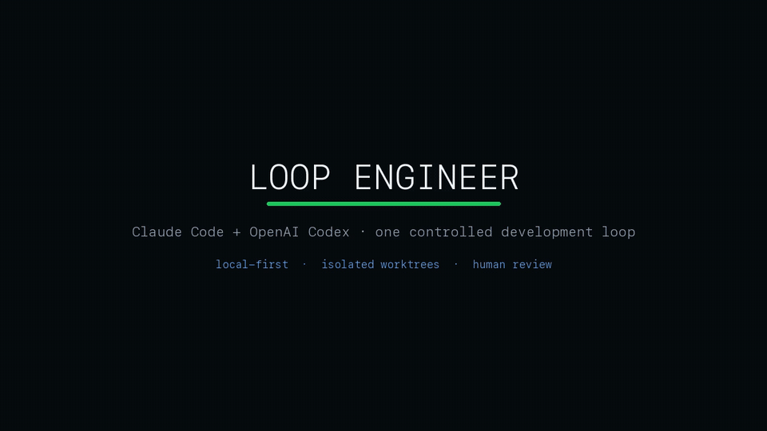
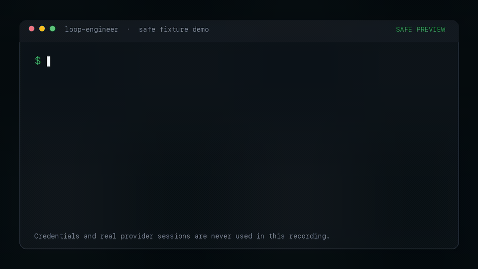
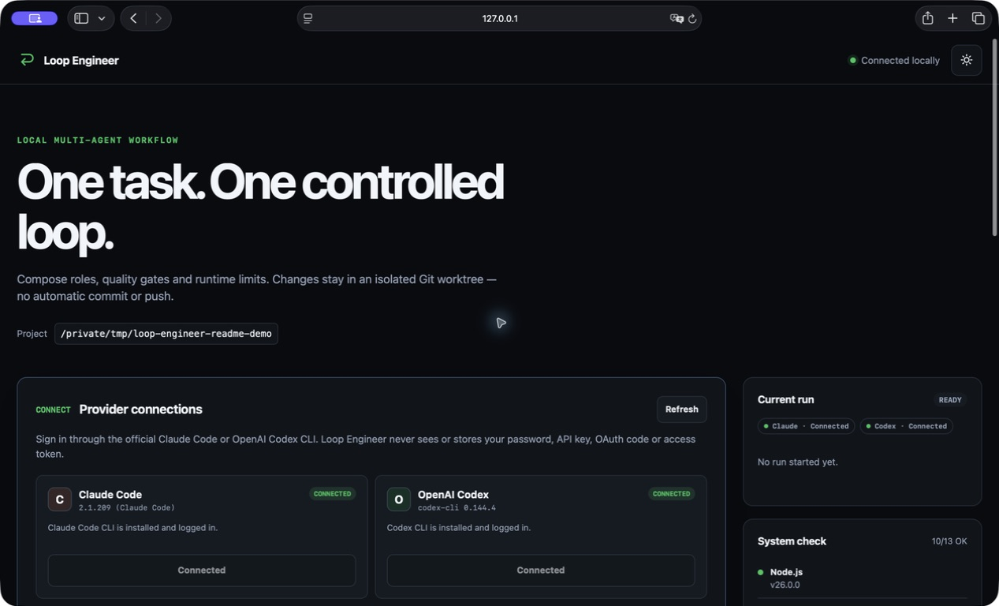
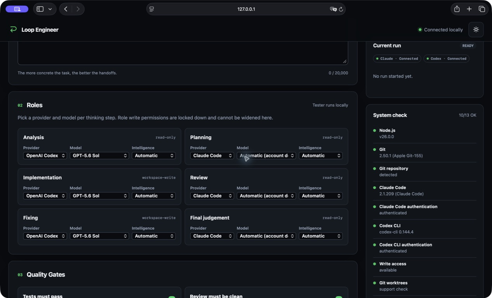
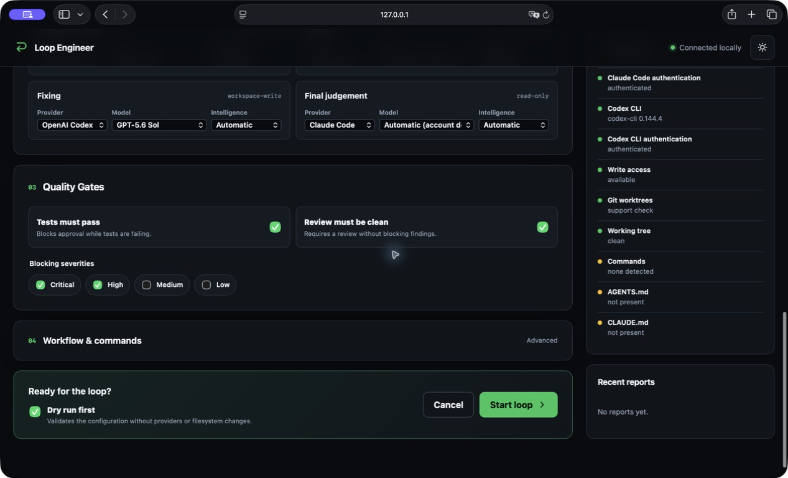

<div align="center">

# Loop Engineer

**Run Claude Code, OpenAI Codex and local checks as one controlled software-development loop.**

[](https://github.com/BotondCsereklye/LoopEngineer/actions/workflows/ci.yml)
[](https://nodejs.org/)
[](https://www.typescriptlang.org/)
[](LICENSE)
[](docs/security.md)

[Demo](#demo) · [Screenshots](#screenshots) · [Quick start](#quick-start) · [How it works](#how-it-works) · [Security](#security-boundaries) · [Documentation](#documentation)

</div>

Loop Engineer gives each agent one role, validates every handoff and keeps writing agents inside an isolated Git worktree. Tests and review gates decide when the loop stops. You inspect the result before anything reaches your branch.

> [!WARNING]
> Loop Engineer is an unofficial open-source project. OpenAI and Anthropic do not sponsor or endorse it. Review generated code and provider output before using either.

## Demo

Check both provider CLIs without exposing credentials:



Preview the workflow, then run the controlled loop:



[Watch the full 23-second MP4](demo/loop-engineer-demo.mp4) or browse the [demo notes and reproducible renderer](demo/README.md).

The recordings use scripted fixture output. They never read a real `~/.claude`, `~/.codex`, repository file, environment secret or provider session.

## Screenshots

### Dashboard and provider connections

See the local project, provider connection states and current-run panel before starting a task.



### Model and intelligence controls

Choose Claude Code or OpenAI Codex, then select the model and intelligence level for each role.



### Quality gates and launch controls

Set blocking severities, require passing tests and start with a safe dry run.



These screenshots come from the running local dashboard against a disposable Git fixture. They contain no repository source or credentials.

## Why Loop Engineer

A long agent chat mixes discovery, implementation, testing and approval in one context. Loop Engineer splits those responsibilities and gives each phase a narrow contract.

| Concern      | Loop Engineer behavior                                                                          |
| ------------ | ----------------------------------------------------------------------------------------------- |
| Agent access | Read-only roles inspect the repository. Writing roles edit only an isolated worktree.           |
| Handoffs     | Zod validates structured JSON between roles. Raw chat transcripts do not become workflow state. |
| Commands     | The local tester runs only configured allowlisted commands without a shell.                     |
| Quality      | Tests and review findings must satisfy explicit gates.                                          |
| Delivery     | Every run ends with a Markdown report, JSON report and reviewable worktree.                     |
| Git          | Loop Engineer creates no commit and sends no push.                                              |

## How it works

```text
ANALYZE -> PLAN -> IMPLEMENT -> TEST -> REVIEW -> DECIDE
                                  ^        |
                                  |        v
                                  +------ FIX
```

| Role        | Default provider     | Access              |
| ----------- | -------------------- | ------------------- |
| Analyst     | Claude Code or Codex | Read-only           |
| Planner     | Claude Code or Codex | Read-only           |
| Implementer | Claude Code or Codex | Worktree write      |
| Tester      | Local command runner | Predefined commands |
| Reviewer    | Claude Code or Codex | Read-only           |
| Fixer       | Claude Code or Codex | Worktree write      |
| Final judge | Claude Code or Codex | Read-only           |

The orchestrator stops when the quality gates pass, a configured cycle or runtime limit expires, progress stalls, a provider fails, or you cancel the run.

## Quick start

### Install

Requirements: Node.js 20+, Git and at least one supported official provider CLI.

```bash
git clone https://github.com/BotondCsereklye/LoopEngineer.git
cd LoopEngineer
npm ci
npm run build
npm link
```

### Configure a project

Run these commands inside a Git repository with at least one commit:

```bash
loopeng init
loopeng doctor
loopeng gui
```

The dashboard opens at `http://127.0.0.1:4317`. Connect the installed provider CLIs, then choose a provider, model and intelligence level for every role. Codex model choices include Sol, Terra and Luna; Claude uses its supported CLI aliases. During a real run, **Current run** shows the active role, provider, model, intelligence level and elapsed thinking time. Session-limit errors include the affected provider, role and reset time when the CLI supplies one.

Prefer the terminal:

```bash
loopeng run --dry-run --task "Add input validation to the settings parser"
loopeng run --task "Add input validation to the settings parser"
```

## Provider connections

The dashboard can start `claude auth login --claudeai` or `codex login`. Each official CLI owns its browser flow, callback and credential store. Loop Engineer receives only installed and authenticated status.

The dashboard contains no password, API-key, OAuth-code or access-token field. Configure API-key, SSO, device-code and enterprise automation flows through the provider's official CLI.

Read [provider setup and smoke tests](docs/providers.md).

## Configuration

`loopeng init` writes `loop-engineer.yml` and detects common project commands. The schema rejects unknown keys, invalid permissions and unsafe tester assignments.

<details>
<summary>Example configuration</summary>

```yaml
version: 1
project:
  root: .
  default_branch: main
workflow:
  name: feature-development
  max_cycles: 3
  max_runtime_minutes: 60
  stop_on_no_progress: true
  require_human_approval_before_apply: false
roles:
  analyst: { provider: codex, model: default, permissions: read-only }
  planner: { provider: claude, model: default, permissions: read-only }
  implementer: { provider: codex, model: default, permissions: workspace-write }
  reviewer: { provider: claude, model: default, permissions: read-only }
  tester: { provider: local, permissions: predefined-commands }
  fixer: { provider: codex, model: default, permissions: workspace-write }
  final_judge: { provider: claude, model: default, permissions: read-only }
quality_gates:
  require_tests_pass: true
  require_clean_review: true
  block_severities: [critical, high]
commands:
  install: ''
  build: 'npm run build'
  test: 'npm test'
  lint: 'npm run lint'
  typecheck: 'npm run typecheck'
security:
  network_access: false
  allow_package_install: false
  allow_commit: false
  allow_push: false
  redact_secrets: true
```

</details>

See the [configuration reference](docs/configuration.md) for every field and validation rule.

## Commands

```text
loopeng init
loopeng doctor
loopeng gui [--no-open] [--port <number>]
loopeng run --task "Add password reset"
loopeng run --task-file task.md
loopeng run --config loop-engineer.yml --task "Fix the parser"
loopeng run --dry-run --task "Preview this workflow"
loopeng status
loopeng report <run-id>
loopeng clean [--force]
```

`doctor` checks Node.js, Git, worktree support, repository state, provider installation and authentication, command detection, instruction files and write access.

## Security boundaries

- Repository content enters prompts inside untrusted-data fences.
- Analyst, planner, reviewer and final judge receive read-only provider permissions.
- Implementer and fixer write only inside the managed worktree.
- The tester rejects chaining, pipes, redirects, command substitution, denied binaries and destructive Git commands.
- Provider login stays inside the official CLI. The dashboard API never handles credentials.
- Logs and reports redact common key, token and password formats before storage.
- Loop Engineer never commits, pushes, force-resets or runs a destructive clean command.

Redaction cannot recognize every custom secret format. Keep `.loop-engineer/` private and treat run reports like build logs. Read the full [security model](docs/security.md) before using the tool on sensitive code.

## Worktrees and reports

Each real run starts from the current commit and creates:

```text
.loop-engineer/
├── runs/<run-id>/
│   ├── report.md
│   ├── report.json
│   ├── task.md
│   ├── config.snapshot.yml
│   └── validated handoffs and provider events
└── worktrees/<run-id>/
    └── generated changes for human review
```

`loopeng clean` removes only marked managed worktrees. It preserves dirty worktrees unless you pass `--force`.

## Documentation

| Guide                                  | Covers                                       |
| -------------------------------------- | -------------------------------------------- |
| [Architecture](docs/architecture.md)   | Components, trust boundaries and data flow   |
| [Workflow](docs/workflow.md)           | State machine, loops and stop conditions     |
| [GUI](docs/gui.md)                     | Local dashboard and provider connections     |
| [Providers](docs/providers.md)         | Claude Code, Codex and the local runner      |
| [Configuration](docs/configuration.md) | Schema, commands and quality gates           |
| [Security](docs/security.md)           | Process, prompt, credential and Git controls |
| [Development](docs/development.md)     | Build, test and contribution workflow        |
| [Roadmap](docs/roadmap.md)             | Planned scope and exclusions                 |

## Limitations

- Provider command flags and machine-readable output can change between CLI releases.
- The context firewall and redactor reduce risk; they cannot prove provider behavior.
- Loop Engineer leaves generated changes in the worktree for manual inspection.
- Windows support depends on Git worktree behavior and provider CLI support on the host.

## Development

```bash
npm ci
npm run lint
npm run typecheck
npm test
npm run test:coverage
npm run build
```

Read [CONTRIBUTING.md](CONTRIBUTING.md), [SECURITY.md](SECURITY.md) and the [Code of Conduct](CODE_OF_CONDUCT.md) before contributing.

## License

[MIT](LICENSE)
